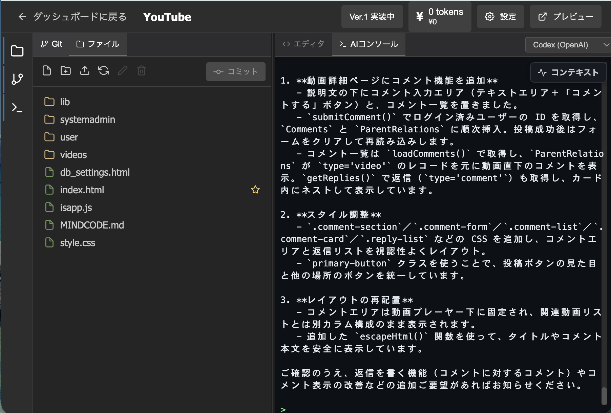
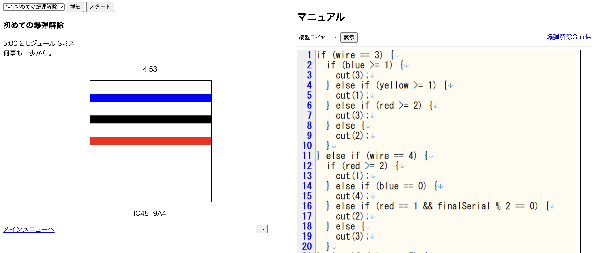

# Kaito Sakamoto

Aspiring Game Programmer | Student

## 👋 About Me

I'm a third-year student at Aoyama Gakuin University and an aspiring game programmer.

I enjoy turning ideas into software, from games to research-oriented web applications. My interests include game development, software architecture, and AI-assisted development tools.

Currently, I am developing MindCode, a research platform for studying human behavior in AI-assisted software development, and a puzzle-roguelike game with Unity.

---

## 🚀 Featured Projects
| Project | Preview |
|----------|----------|
| MindCode |  |
| Puzlog |  |
| Bomb Defusal Game |  |

### MindCode

A web-based AI-assisted vibe coding platform developed for academic research.

**Highlights**

* Research platform for studying AI-assisted development
* React, Express, MySQL, Docker
* Google OAuth authentication
* User behavior logging system

📄 [View Project Details](./projects/mindcode.md)

---

### Puzzle × Roguelike Game

A Unity game project combining puzzle mechanics with roguelike progression.

**Highlights**

* Original game concept
* Core system design
* Gameplay programming
* Team development (2 members)

📄 [View Project Details](./projects/puzlog.md)

---

### Bomb Defusal Game

🏆 Awarded Best Project in a university course final presentation.

A browser-based puzzle game developed using HTML, CSS, and JavaScript.

🎮 Play Online:
https://tiizu727.github.io/bomb/frontend/

📄 [View Project Details](./projects/bomb.md)

---

## 📚 Research Activities

### IS175

* System developer and co-author
* Contributed to a research project through system implementation

### SSS2026 (Under Review)

* MindCode project lead
* System design and implementation
* Research development and paper preparation

---

## 🛠 Technologies

### Game Development

* Unity
* C#

### Web Development

* JavaScript
* React
* Express

### Database & Infrastructure

* MySQL
* Docker

### Development Tools

* Git
* GitHub

---

## 📫 Contact

* GitHub: @Tiizu727
